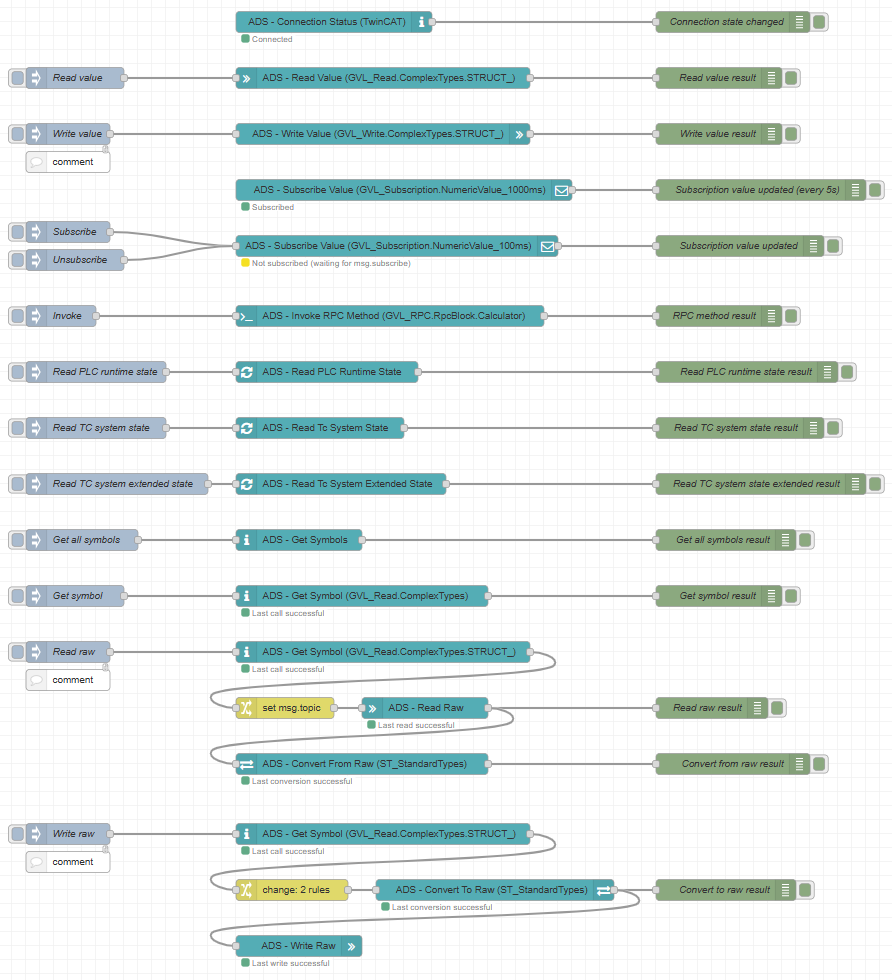

# node-red-contrib-ads-client

[](https://www.npmjs.org/package/node-red-contrib-ads-client)
[](https://github.com/jisotalo/node-red-contrib-ads-client)
[](https://choosealicense.com/licenses/mit/)

Beckhoff TwinCAT ADS client library for Node-RED (unofficial).

Connect to a Beckhoff TwinCAT automation system using the ADS protocol from a Node-RED. This is a wrapper over the battle-tested [ads-client](https://github.com/jisotalo/ads-client) Node.js library.

# Project status

xx.09.2025 - version 2 released!

- Based on ads-client v.2
- See [CHANGELOG.md](https://github.com/jisotalo/node-red-contrib-ads-client/blob/master/CHANGELOG.md) for details and migration.
  
# Features
- Supports TwinCAT 2 and 3
- Supports connecting to the local TwinCAT 3 runtime 
- Supports any kind of target systems with ADS protocol (local runtime, PLC, EtherCAT I/O...)
- Supports multiple connections from the same host
- Reading and writing any kind of variables
- Subscribing to variable value changes (ADS notifications)
- Automatic conversion between PLC and Javascript objects
- Calling function block methods (RPC)
- Automatic 32/64 bit variable support (PVOID, XINT, etc.)
- Automatic byte alignment support (all pack-modes automatically supported)
- Handles TwinCAT restarts, configuration changes and PLC software updates automatically 

# Installing
```bash
cd ~/.node-red
npm i node-red-contrib-ads-client
```
# Documentation

Please see [ads-client documentation](https://jisotalo.fi/ads-client/classes/Client.html) for more details and help. This is just a wrapper over it so documentation is kept short.

Each node has its own built-in documentation - see the help under each node in Node-RED.


# Available nodes

**NOTE:**
At the moment, not all ads-client features are converted to the Node-RED nodes.

| Node                      | Description                                                                                             | Equivalent in [ads-client](https://github.com/jisotalo/ads-client) | More info |
| ------------------------- | ------------------------------------------------------------------------------------------------------- | ------------------------------------------------------------------ | --------- |
| ADS - Connection Status   | Reports status changes of the selected ADS connection.                                                  | `connect`, `disconnect` and `reconnect` events                     | (todo)    |
| ADS - Read Value          | Reads any kind of variable by given variable name.                                                      | `readValue()`                                                      |
| ADS - Write Value         | Writes given value to any kind of variable by given variable name.                                      | `writeValue()`                                                     |
| ADS - Subscribe           | Subscribes to given variable to receive notifications.                                                  | `subscribe()`                                                      |
| ADS - Invoke RPC Method   | Calls a function block method with parameters using RPC (remote procedure call).                        | `invokeRpcMethod()`                                                |
| ADS - Read Runtime State  | Reads TwinCAT PLC runtime state (run, stop) from given ADS port.                                        | `readPlcRuntimeState()`                                            |
| ADS - Read TcSystem State | Reads TwinCAT System Manager state from target (using ADS port 10000).                                  | `readTcSystemState()`                                              |
| ADS - Get Symbols         | Returns all symbols from the target PLC runtime.                                                        | `getSymbols()`                                                     |
| ADS - Get Symbol          | Returns a symbol object for given variable path, such as `GVL_Test.ExampleStruct`.                      | `getSymbol()`                                                      |
| ADS - Read Raw            | Reads (raw byte) data from PLC by given index group, index offset and size.                             | `readRaw()`                                                        |
| ADS - Write Raw           | Writes (raw byte) buffer data to PLC by given index group and index offset.                             | `writeRaw()`                                                       |
| ADS - Convert To Raw      | Converts given Javascript object/variable to raw Buffer data by given data type (like REAL, ST_Struct). | `convertToRaw()`                                                   |
| ADS - Convert From Raw    | Converts given raw data (byte Buffer) to Javascript object by given data type (like REAL, ST_Struct).   | `convertFromRaw()`                                                 |

# Getting started
After you have installed the package and restarted Node-RED, you should see the available ADS nodes in your nodes list.


## Adding a connection

1. Drag any ADS node to the flow, such as `ADS - Read Value`
2. Double click the node
3. Next to **ADS connection** setting, press + button to add a new connection


4. Enter a friendly name to the connection
5. Enter target settings
    - `Target AmsNetId` - Target PLC AmsNetId
    - `Target ADS port` - Target runtime ADS port
    - For help and more, see [ads-client documentation](https://jisotalo.fi/ads-client/classes/Client.html#settings)
6. Press Add. A new ADS connection is created.
   
## Examples

The [`./examples/example-all-nodes.json`](./examples/example-all-nodes.json) includes an example for each node. 

It connects to a local usermode PLC runtime and requires a running [https://github.com/jisotalo/ads-client-test-plc-project](https://github.com/jisotalo/ads-client-test-plc-project) to work. 



# FAQ

See [ads-client README](https://github.com/jisotalo/ads-client?tab=readme-ov-file#common-issues-and-questions)

# License

Licensed under [MIT License](http://www.opensource.org/licenses/MIT).

Copyright (c) Jussi Isotalo <<j.isotalo91@gmail.com>>

Permission is hereby granted, free of charge, to any person obtaining a copy
of this software and associated documentation files (the "Software"), to deal
in the Software without restriction, including without limitation the rights
to use, copy, modify, merge, publish, distribute, sublicense, and/or sell
copies of the Software, and to permit persons to whom the Software is
furnished to do so, subject to the following conditions:

The above copyright notice and this permission notice shall be included in all
copies or substantial portions of the Software.

THE SOFTWARE IS PROVIDED "AS IS", WITHOUT WARRANTY OF ANY KIND, EXPRESS OR
IMPLIED, INCLUDING BUT NOT LIMITED TO THE WARRANTIES OF MERCHANTABILITY,
FITNESS FOR A PARTICULAR PURPOSE AND NONINFRINGEMENT. IN NO EVENT SHALL THE
AUTHORS OR COPYRIGHT HOLDERS BE LIABLE FOR ANY CLAIM, DAMAGES OR OTHER
LIABILITY, WHETHER IN AN ACTION OF CONTRACT, TORT OR OTHERWISE, ARISING FROM,
OUT OF OR IN CONNECTION WITH THE SOFTWARE OR THE USE OR OTHER DEALINGS IN THE
SOFTWARE.
